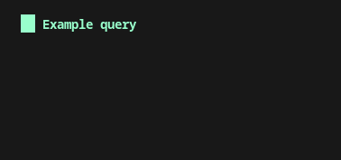

# CyScout

## Run queries and detect vulnerabilities in your smart contracts using CodeQL-Solidity

)

This repository contains CoinFabrik's ongoing research and development to extend CodeQL support to the Solidity smart contract language. By leveraging the foundational work done by the CodeQL team for Ruby, we have adapted and expanded their approach to create a powerful toolset for analyzing Solidity code.

## 🔍 Overview

Our goal is to provide a comprehensive set of tools for querying and detecting vulnerabilities in Solidity smart contracts. We build upon the work of [Joran Honig's Solidity Tree-sitter grammar](https://github.com/JoranHonig/tree-sitter-solidity) and the CodeQL team's [Ruby implementation](https://github.blog/security/web-application-security/code-scanning-and-ruby-turning-source-code-into-a-queryable-database/). The project includes an extractor, database schema generation, and abstractions such as a cleaner Abstract Syntax Tree (AST), Control Flow Graph (CFG), and Dataflow analysis. These elements enable complex vulnerability detection and querying, similar to the C++ libraries in CodeQL.

## 🚀 Project Status

- **Extractor and Database Schema**: Usable and functional for Solidity codebases.
- **Current Work**: We are actively developing a cleaner AST, CFG, and Dataflow support to enhance the detection of vulnerabilities.
- **Proof of Concept (PoC)**: Nine simple detector examples are provided to demonstrate basic usage and potential.

## 🏁 Getting Started

To get started with analyzing Solidity smart contracts using CodeQL, follow these steps:

### Setting Up CodeQL Solidity

Work in progress

### Install CodeQL Solidity Extension


### Run Sample Detectors

Once the database is created, you can run sample detectors written in the QL language:

```bash
codeql query run /path-to-detector/ -d /path-to-created-database/
```

For instance:

```shell
[1/1] Found in cache: /home/user/codeql/solidity/ql/lib/detector3.ql.
detector3.ql: Evaluation completed (191ms).
|      col0       |                                     col1                                     |
+-----------------+------------------------------------------------------------------------------+
| YulFunctionCall | /home/user/codeql/solidity-test/bitshift-order-test/vulnerable.sol@4:18:4:26 |
Shutting down query evaluator.
```

## Detectors

| Num | Detector    | What it Detects                                                      |
| --- | ----------- | -------------------------------------------------------------------- |
| 1   | `transfer-from` | transferFrom uses arbitrary `from`                  |
| 2   | `incorrect-shift` | incorrect order of arguments in bit shift operations |
| 3   | `msg-valu-in-for-loop` | Detects the use of msg.value inside a loop    |
| 4   | `bad-prng` | Detects bad randomness            |
| 5   | `divide-before-multiply` | Detects loss of precision  |
| 6   | `incorrect-exp` | Detects use of bitwise xor instead of exponential   |
| 7   | `unchecked-send` | The return value of a send is not checked    |
| 8   | `is-unreachable` | Detects dead code   |
| 9   | `unprotected-self-destruct` | Detects unprotected call to selfdestruct/suicidal   |


### Further Documentation

## Work In Progress

We are actively working on enhancing the capabilities of our Solidity CodeQL implementation. Our current focus and status is on:

- AST: usable
- CFG: experimental
- DFA: soon

For more detailed instructions on using CodeQL, refer to the [official CodeQL documentation](https://codeql.github.com/docs/).

## 🤝 Contributing

We welcome contributions to enhance and expand the support for Solidity in CodeQL. Feel free to submit issues, feature requests, or pull requests.

For more information, please refer to the [Contribution Guidelines](/docs/Contributing.md).

## License

The code in this repository is licensed under the [MIT License](LICENSE.md) by CoinFabrik.

For further information on CodeQL and CodeQL CLI licensing, please refer to the official [repo](https://github.com/github/codeql-cli-binaries).
